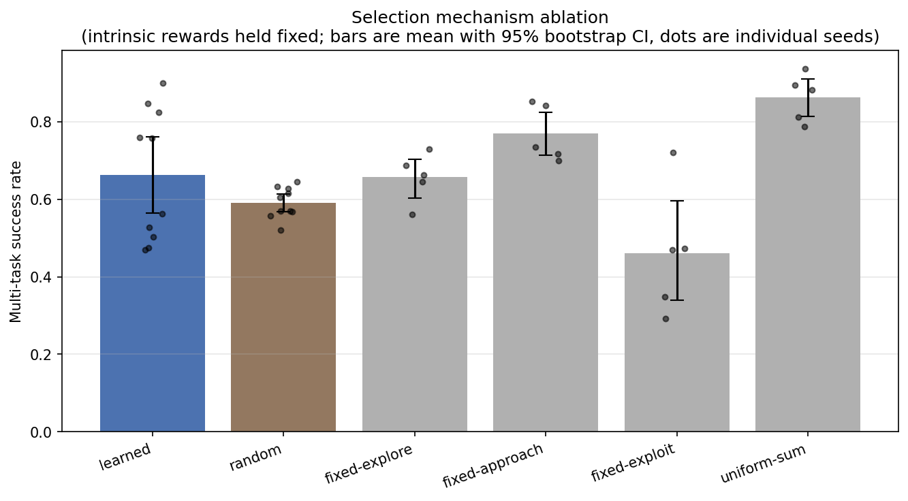
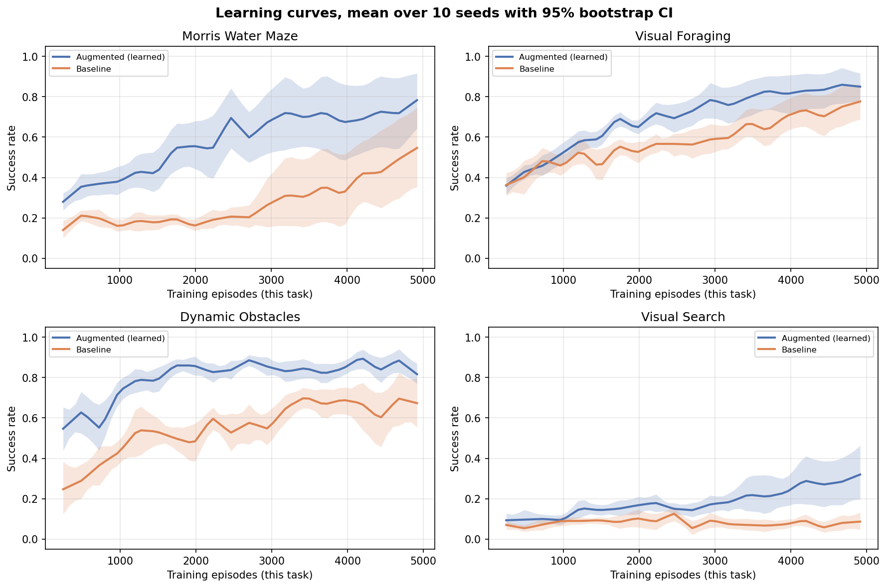

# Prefrontal-Inspired Control for Adaptive Goal Selection in Reinforcement Learning

Mihir Sharma, Hillary Kchao, Daniil Kardava, David Comfort, Daniel Eybelman, Anne Zhang
— Neurotech@Berkeley, University of California, Berkeley

> Poster, 2026 California Neurotechnology Conference:
> [`poster/2026-california-neurotechnology-conference-poster.pdf`](poster/2026-california-neurotechnology-conference-poster.pdf)
> ([Drive mirror](https://drive.google.com/file/d/1Vuspbu8ETigrhs7cYh49ViCQvucvfFnO/view?usp=sharing))
>
> The poster reports the April three-seed result. The tables below supersede
> it: ten seeds with confidence intervals, and a selection-mechanism ablation
> the poster does not have. The headline effect shrinks from +25.9 pp to
> +16.9 pp, and the ablation shows the meta-controller is not its source.

## Hypothesis

A model equipped with a **meta-controller that selects its own optimization
sub-objective** — receiving supplementary intrinsic rewards on top of standard
task rewards — will develop more generalizable behavior across tasks than a
model trained with a fixed objective alone. 

**Biological inspiration:** The prefrontal cortex (PFC) does not replace the
brain's reward system. It *modulates* it. Dopaminergic signals from the VTA
reach both the striatum (basic reward learning) and the PFC (executive
control). The PFC selects what to optimize for in the short term — curiosity,
goal-directed approach, or exploitation of known rewards — while the underlying
reward circuitry continues to function normally. We replicate this two-level
architecture: a shared reward signal trains both models equally, while the
augmented model's meta-controller adds a supplementary intrinsic signal that
varies by context.

**Outcome, stated up front:** the augmented model does outperform the baseline
(+16.9 pp over 10 seeds), but the ablation in [Results](#results) shows the
learned meta-controller is not what produces that gain — random selection
performs indistinguishably, and no selection at all performs better. The
supplementary intrinsic reward helps; the PFC-inspired selection mechanism, as
implemented here, does not.

---

## Relation to prior work

This is a small-scale, controlled study of an existing family of ideas, not a
new one. A meta-controller that picks sub-goals for a lower-level policy, with
the lower level driven by intrinsic reward, is hierarchical reinforcement
learning as it has been formulated since the late 1990s, and the specific
mapping from that architecture onto prefrontal function has been made before.
The contribution here is a controlled comparison at a scale where the
comparison can actually be run cleanly, not a new mechanism.

**The framework.** Temporally extended actions are formalized by the options
framework of Sutton, Precup & Singh (1999), *Between MDPs and semi-MDPs: A
framework for temporal abstraction in reinforcement learning*, Artificial
Intelligence 112(1–2), 181–211. The 16-step commitment used here is a
fixed-duration option in that sense, with a hand-specified rather than learned
termination condition.

**The closest prior work** is Kulkarni, Narasimhan, Saeedi & Tenenbaum (2016),
*Hierarchical Deep Reinforcement Learning: Integrating Temporal Abstraction and
Intrinsic Motivation*, NeurIPS 2016 (h-DQN). That paper already has the central
element of this project: a meta-controller that selects a sub-goal, and a lower
level trained on an intrinsic reward defined by the selected sub-goal. The
architecture here is a small variant of theirs — PPO instead of DQN, a fixed
library of three hand-designed intrinsic reward functions instead of learned
object-centric goals, and a recurrent selector.

Other established variants of the same idea: Bacon, Harb & Precup (2017), *The
Option-Critic Architecture*, AAAI 2017, pp. 1726–1734, which learns option
policies and termination conditions end to end rather than fixing the
commitment interval; Vezhnevets, Osindero, Schaul, Heess, Jaderberg, Silver &
Kavukcuoglu (2017), *FeUdal Networks for Hierarchical Reinforcement Learning*,
ICML 2017, whose Manager sets directional sub-goals in a learned latent space
at a fixed temporal resolution; and Nachum, Gu, Lee & Levine (2018),
*Data-Efficient Hierarchical Reinforcement Learning*, NeurIPS 2018 (HIRO),
which makes the same two-level structure work off-policy.

**The PFC framing is not novel to this project.** Wang, Kurth-Nelson, Kumaran,
Tirumala, Soyer, Leibo, Hassabis & Botvinick (2018), *Prefrontal cortex as a
meta-reinforcement learning system*, Nature Neuroscience 21, 860–868, is the
standard reference for treating prefrontal cortex as a second learning system
trained by dopaminergic signals — the exact two-level story told in the
Hypothesis section above. Botvinick, Niv & Barto (2009), *Hierarchically
organized behavior and its neural foundations: A reinforcement learning
perspective*, Cognition 113(3), 262–280, had already argued that hierarchical
RL is the right computational account of prefrontally organized behavior.

**Intrinsic reward** as an exploration signal is likewise established:
Pathak, Agrawal, Efros & Darrell (2017), *Curiosity-driven Exploration by
Self-supervised Prediction*, ICML 2017, pp. 2778–2787, and Burda, Edwards,
Storkey & Klimov (2019), *Exploration by Random Network Distillation*, ICLR
2019 (arXiv:1810.12894, 2018). Both use a learned prediction-error bonus; the
EXPLORE sub-objective here is a much cruder count-based novelty signal.

### What is this project's own

- **A PFC-grounded sub-objective library.** The three sub-objectives are chosen
  to correspond to specific reward pathways — novelty (dopaminergic), approach
  (mesolimbic), and harvest (dorsal striatal habit) — rather than being derived
  from task structure, and the meta-controller receives no dense task reward, so
  it must find which drive pays off from failure avoidance alone.
- **A 16-step temporal commitment** with an explicit credit-assignment
  justification and the interval treated as a reported design parameter.
- **A parameter-matched, single-variable comparison.** Both arms are held to
  within 540 parameters (0.998x), the same episode budget, the same multi-task
  interleaved schedule, the same seeds, and the same evaluation protocol.
- **A selection-mechanism ablation** that holds the intrinsic rewards fixed and
  varies only how the sub-objective is chosen, which is what separates "the
  intrinsic rewards help" from "learning which sub-objective to use helps".
- **A five-axis generalizability evaluation** — multi-task performance,
  zero-shot transfer, few-shot adaptation, catastrophic forgetting and strategy
  diversity — rather than a single aggregate score.

None of these is a new mechanism. What they buy is a comparison at a scale
where every confound can be controlled and every run can be repeated, which is
hard to do at the scale the papers above operate at.

---

## Results

All numbers below come from 10 seeds (0–7, 42, 123) at 20,000 episodes per
model, and every one traces to a committed `evaluation_report.json` under
`results_main/` or `results_ablation_*/`. Intervals are 95% percentile
bootstrap CIs over seeds, stratified by task. Differences between arms are
success-rate differences and are therefore in **percentage points (pp)**.

Tables are pasted verbatim from `results_aggregate/tables.md`, which
`aggregate_results.py` regenerates from the per-seed reports.

### Headline: the augmented model beats the baseline, by less than previously reported

| Task | Augmented (learned) | Baseline | Delta (pp) |
|---|---|---|---|
| Morris Water Maze | 0.664 [0.487, 0.837] | 0.533 [0.329, 0.736] | 13.1 [-15.6, 43.3] |
| Visual Foraging | 0.803 [0.684, 0.914] | 0.690 [0.579, 0.809] | 11.3 [-5.1, 27.8] |
| Dynamic Obstacles | 0.870 [0.846, 0.893] | 0.663 [0.592, 0.738] | 20.7 [13.2, 27.1] |
| Visual Search | 0.314 [0.174, 0.482] | 0.087 [0.057, 0.120] | 22.7 [9.3, 38.0] |
| **Overall** | **0.663 [0.564, 0.764]** | **0.493 [0.406, 0.586]** | **16.9 [3.8, 30.3]** |
| **Overall (IQM)** | **0.732** | **0.505** | **+22.7** |

The overall advantage is **+16.9 pp [3.8, 30.3]**. The interval excludes zero,
so the effect is real at this sample size, but it is smaller than the +25.9 pp
reported from three seeds, and only two of the four per-task intervals exclude
zero.

The augmented model wins **31 of 40** task × seed cells, not the 12 of 12
claimed from three seeds. It loses the overall comparison on 3 of 10 seeds.
Per-seed deltas run from **-14.5 pp to +50.0 pp** — the seed-to-seed spread is
larger than the effect being measured, which is the single most important
context for every number on this page.

### The selection-mechanism ablation, which does not support the hypothesis

The hypothesis is about a meta-controller that *selects* sub-objectives. These
arms hold the intrinsic rewards, the encoder, the 0.08 scale, the 16-step
commitment, the seeds and the evaluation protocol fixed, and vary only how the
sub-objective is chosen.

| Selection mechanism | Seeds | Multi-task success | vs. learned (pp) | Trained params |
|---|---|---|---|---|
| `learned` | 10 | 0.663 [0.564, 0.763] | -- | 231,050 |
| `random` | 10 | 0.591 [0.567, 0.614] | -7.2 [-17.8, 3.6] | 152,518 |
| `fixed-explore` | 5 | 0.657 [0.603, 0.703] | -4.7 [-16.7, 7.3] | 152,518 |
| `fixed-approach` | 5 | 0.769 [0.714, 0.825] | 6.6 [-9.9, 23.1] | 152,518 |
| `fixed-exploit` | 5 | 0.461 [0.340, 0.596] | -24.3 [-31.9, -15.7] | 152,518 |
| `uniform-sum` | 5 | 0.863 [0.814, 0.909] | 15.9 [3.6, 29.8] | 152,518 |

**Stated plainly: the learned meta-controller is not the source of the gain.**

- **Choosing at random is as good as learning to choose.** `random` sits 7.2 pp
  below `learned`, but the interval [-17.8, +3.6] contains zero. Ten seeds
  cannot distinguish a GRU that learned which sub-objective to pursue from a
  uniform coin flip every 16 steps. The GRU's 78,532 parameters are not
  earning their place.
- **Not selecting at all is better.** `uniform-sum`, which makes no choice and
  simply sums all three intrinsic rewards, beats `learned` by 15.9 pp with an
  interval [3.6, 29.8] that excludes zero. It is also the most consistent arm
  across seeds.
- **A single fixed sub-objective matches the meta-controller.** `fixed-approach`
  at 0.769 is nominally above `learned`, and `fixed-explore` is level with it.

What the ablation *does* establish is that the sub-objectives are not
interchangeable: `fixed-exploit` is 24.3 pp worse than `learned`, well outside
its interval. Committing to the wrong drive is costly. But the meta-controller
does not beat the good fixed choices, and does not beat no choice at all.

The most defensible reading of the main result is therefore that the
**intrinsic rewards** are doing the work — ordinary reward shaping — and the
learned selection on top of them is not contributing measurably.

**One caveat that cuts against over-reading `uniform-sum`.** It receives all
three intrinsic rewards every step, so its total intrinsic magnitude is roughly
two to three times any single-objective arm's. Its advantage may be a
reward-magnitude effect rather than evidence that selection is actively
harmful. A magnitude-matched `uniform-sum` (dividing the sum by three, or
retuning the 0.08 scale per arm) is the obvious next run and has not been done.



### Visual Search: neither model solves this task

Visual Search has the largest per-task delta (+22.7 pp), and unlike the
three-seed result it is now statistically reliable. It should still not be read
as support for the hypothesis. The better arm succeeds on 31% of episodes and
fails on 69%; the baseline is at 8.7%. This is a comparison between a model
that fails most of the time and one that fails almost always, on the one task
in the suite that neither model has learned. It is excluded from any
"wins across the board" framing.

### Other metrics

- **Zero-shot transfer** to unseen task variants: augmented
  0.658 [0.561, 0.755] vs baseline 0.495 [0.405, 0.587], a delta of
  16.3 pp [2.7, 29.2] — tracking the multi-task result closely.
- **Few-shot adaptation**: the augmented model reaches the 70% threshold in 20
  episodes on 9 of 10 seeds; the baseline does so on 6 of 10, and otherwise
  takes 51–200 episodes or never reaches it. Note this measurement does not
  fine-tune (see Generalizability Evaluation).
- **Catastrophic forgetting**: low for both, augmented mean 2.1%.
- **Strategy diversity**: selection entropy 0.30–1.08 across task × seed. The
  low end is near-collapse onto a single sub-objective, which is consistent
  with the ablation finding that the selection is not carrying information.



### How these numbers differ from the conference poster

The poster reports +25.9 pp overall from three seeds (42, 7, 123) and 12 of 12
wins. Three changes account for the difference, in rough order of size:

1. **Ten seeds instead of three.** The per-seed spread (-14.5 to +50.0 pp) is
   wide enough that a three-seed mean was not a stable estimate. Two of the
   three original seeds happened to be favourable.
2. **A train/evaluation consistency fix.** Evaluation used to re-select a
   sub-objective every step while training committed for 16. Both now commit
   for 16. This changes which checkpoint early stopping selects, and therefore
   changes results for the same seed.
3. **Different hardware** (CPU here, RTX 4070 SUPER for the April runs), and
   evaluation environments are unseeded, so runs are not bit-reproducible.

Re-running the three original seeds under the current code gives, for example,
seed 7 baseline 0.255 → 0.713. A shift that large on a fixed seed is itself
evidence that three seeds was far too few to support the original claim.

The April runs are kept unmodified in `results/`, `results_seed42/`,
`results_seed7/` and `results_seed123/`.

---

## Experimental Controls

What was **held constant** between the two arms:

- Episode budget: 20,000 episodes per model (5,000 per task x 4 tasks)
- Parameter count: 231,050 vs 231,590 (0.998x ratio, a 540-parameter gap)
- Training schedule: both are a single shared model trained multi-task
  interleaved with round-robin scheduling and a shared optimizer
- Environment seeds, so both arms see the same task layouts
- Evaluation protocol: `deterministic=True`, 100 episodes per task, and
  best-checkpoint restoration for both arms
- The dense task reward from the environment

What was **varied**: the augmented model additionally receives a supplementary
intrinsic reward, scaled by 0.08, from the sub-objective its meta-controller
selected. That is the whole intervention.

**What this licenses, and what it does not.** Holding the above constant means
a difference between the two arms is attributable to the intrinsic-reward
intervention rather than to capacity, budget, schedule, task layout or
evaluation asymmetry. It does *not* on its own attribute the difference to the
**selection** of sub-objectives, because the main comparison varies the
intrinsic reward and the selection mechanism together. Separating those two is
what the selection-mechanism ablation above is for, and the ablation is the
result that should be read when asking whether the meta-controller is doing the
work. It reports that the meta-controller is not distinguishable from random
selection and is beaten by no selection at all, so the +16.9 pp should be
attributed to the intrinsic rewards, not to the PFC-inspired mechanism the
hypothesis is about.

Three further limits worth stating plainly: four tasks from a single family
(20x20 grid-worlds, identical action space and observation format) do not
support claims about generalization beyond that family; the architecture that
produces these numbers was selected against this same evaluation suite (see
[`LAB_NOTEBOOK.md`](LAB_NOTEBOOK.md), 2026-04-19), so the effect size is a
post-selection estimate; and evaluation environments are unseeded, so a single
run is not bit-reproducible even though the across-seed intervals account for
that noise.

---

## Experimental Design

### Two Models (Design B)

Both models receive **the same dense task reward**. The augmented model
additionally receives a scaled intrinsic reward from its meta-controller's
selected sub-objective.

| Component | Augmented (PFC) | Baseline (Fixed) |
|-----------|----------------|------------------|
| CNN encoder | Shared architecture | Same architecture |
| Dense task reward | Yes | Yes |
| Meta-controller | GRU-based, selects sub-objective | -- |
| Intrinsic reward | Yes (0.08x scale) | -- |
| Sub-objective conditioning | Policy sees [latent; obj_embedding] | Policy sees [latent] |
| Parameters | 231,050 | 231,590 |

The augmented model's action policy reward is:

```
reward = dense_task_reward + 0.08 * intrinsic_reward(selected_sub_objective)
```

The meta-controller is trained separately with:

```
meta_reward = sparse_failure_penalty + 0.2 * intrinsic_reward(selected_sub_objective)
```

The meta-controller receives **no dense task reward**. It must discover which
sub-objectives are productive purely from whether they avoid failure and
generate useful intrinsic signals.

### Selection-mechanism ablation arms

`--meta-mode` replaces the learned selection with an exogenous rule while
holding everything else — encoder, intrinsic reward functions, 0.08 scale,
16-step commitment boundaries, seeds, episode budget, evaluation protocol —
fixed:

| Mode | Behavior |
|---|---|
| `learned` | GRU meta-controller selects (default; the headline model) |
| `random` | uniform random sub-objective every 16 steps — **the decisive comparison** |
| `fixed-explore` / `fixed-approach` / `fixed-exploit` | one sub-objective for the whole episode |
| `uniform-sum` | sum of all three intrinsic rewards, no selection |

Every arm still emits a sub-objective embedding to the policy, so the
conditioned input is 288-dim throughout and no arm gains or loses input
dimensionality. `uniform-sum` makes no selection at all, so it is conditioned
on the mean of the three embeddings.

**Parameter parity under ablation.** In every arm other than `learned`, the GRU
meta-controller and the meta-value head are instantiated but never run: they
take no gradient and have no effect on behavior. Those arms therefore train and
act with **152,518** parameters, not 231,050. The ablation table reports the
number that is actually doing work.

---

## Architecture

```
AUGMENTED MODEL                           BASELINE MODEL

Observation --> CNN Encoder               Observation --> CNN Encoder
                    |                                          |
              Latent State (256)                        Latent State (256)
               +----+----+                                    |
    Meta-       |         |                              Action Policy
  Controller   Embed(32) Action                          (wider hidden
  (GRU-based)     |      Policy                           for parity)
       |     [latent;embed]                                   |
  Selects k    = 288-dim                                   Action
  (every 16        |
   steps)      Action

Meta-ctrl loss: sparse + 0.2*intrinsic
Policy loss:    dense + 0.08*intrinsic    Policy loss: dense only
```

### GRU-Based Recurrent Meta-Controller

The meta-controller uses a `GRUCell` to integrate information over time,
mirroring how the biological PFC maintains working memory. The GRU hidden
state accumulates a summary of what the agent has seen and done, enabling
decisions like "I've been exploring for 40 steps with no progress -- switch
to approach."

- Hidden state resets on episode boundaries
- Per-step hidden states stored in the rollout buffer for correct PPO
  re-evaluation after mini-batch shuffling

### Temporal Commitment

The meta-controller selects a sub-objective every **16 steps**, not every step.
Between selections, the chosen strategy is held constant. This design choice
has three motivations:

1. **Credit assignment**: Selecting at every step creates 300 decisions per
   episode with sparse feedback -- an impossible credit assignment problem.
   At 16-step intervals, there are ~18 decisions per episode.
2. **Policy stability**: Per-step switching destabilizes the action policy,
   which is conditioned on the sub-objective embedding. The policy needs time
   to execute a coherent strategy before the strategy changes.
3. **Biological fidelity**: PFC executive control operates on timescales of
   seconds, not milliseconds.

The same 16-step commitment applies at evaluation time. It did not until
2026-08-11 — evaluation used to re-decide every step, which is inconsistent
with training and would have made the ablation arms incomparable.

### Sub-Objective Library

The meta-controller selects from three sub-objectives, each with a
hand-designed intrinsic reward function:

| Sub-Objective | Intrinsic Reward Signal | Biological Analogue |
|---------------|------------------------|---------------------|
| **EXPLORE** | Visiting novel grid cells | Dopaminergic novelty signal |
| **APPROACH** | Decreasing distance to salient targets | Goal-directed approach (mesolimbic) |
| **EXPLOIT** | Proximity to goal ("stay and harvest") | Habit formation (dorsal striatum) |

Reduced from 5 to 3 sub-objectives (removed AVOID and MEMORIZE) based on
empirical analysis showing they were consistently underused (<5% and <18%
selection rates respectively). Fewer sub-objectives means each mode gets 1/3
of training data instead of 1/5, and the meta-controller's credit assignment
is simpler (3 choices vs 5).

**Caveat:** those selection rates were measured on the same four tasks the
results are reported on, with no held-out task, so the reduction is a form of
tuning on the evaluation set. All results reported here were produced *after*
the reduction — no reported number comes from a five-sub-objective run. The
same pass that made this reduction also changed the embedding dimension and the
commitment interval and was run immediately after the evaluation had read null,
so the reported effect size should be read as a post-selection estimate rather
than an unbiased one. The full sequence is in
[`LAB_NOTEBOOK.md`](LAB_NOTEBOOK.md).

---

## Task Suite

All tasks are 20x20 grid-worlds rendered as 3-channel RGB images. They are
designed as lightweight analogues of neuroscience experiments that benefit from
flexible strategy selection.

### 1. Morris Water Maze

The agent is placed at a random edge of a circular pool and must find a hidden
platform. A subtle proximity gradient provides a learnable signal. Four colored
landmark cues at the pool edges provide allocentric spatial reference, matching
the real experimental protocol.

### 2. Visual Foraging

Collect food items scattered across the environment while avoiding moving
predator zones. Requires balancing exploration and exploitation.

### 3. Dynamic Obstacle Course

Navigate from the bottom-left to the top-right through a field of moving
obstacles. Requires reactive path planning.

### 4. Visual Search with Cues

Locate a hidden target among distractors. Colored arrow trail cues guide
the agent toward the target. **Neither model solves this task** — see Results.

---

## Generalizability Evaluation

The experiment measures five dimensions:

1. **Multi-task performance** -- Average success rate across all four tasks.
   Both models use one shared set of weights trained interleaved across tasks.

2. **Zero-shot transfer** -- Performance on unseen task variants (new platform
   positions, different obstacle patterns) with no additional training.

3. **Few-shot adaptation** -- Episodes needed to reach a threshold success rate
   on a novel variant. Note that this measurement does **not** fine-tune: it
   runs fixed weights and reports how quickly rolling success crosses the
   threshold.

4. **Catastrophic forgetting** -- Performance degradation on earlier tasks after
   continued training on all tasks.

5. **Strategy diversity** -- Entropy of the meta-controller's sub-objective
   selections per task.

---

## Running the Experiment

### Install

```bash
python3 -m venv .venv && source .venv/bin/activate
pip install -r requirements.txt
```

### Quick test (~1 min)

```bash
python run_experiment.py --mode smoke_test
```

### One full run

```bash
python run_experiment.py --mode full --episodes 5000 --seed 42 --results-dir results_main/seed42
```

`--episodes 5000` is per task, so this is the 20,000-episode-per-model budget
all reported results use. On a single CPU core a full run takes a few hours; on
a GPU it is roughly 30 minutes.

### One ablation arm

```bash
python run_experiment.py --mode ablation --meta-mode random --episodes 5000 \
    --seed 42 --results-dir results_ablation_random/seed42
```

### Everything reported in this README

```bash
./scripts/run_all.sh          # 40 runs; set WORKERS to your core count
python aggregate_results.py   # rebuilds the tables and figures below
```

`scripts/run_all.sh` skips runs that already have an `evaluation_report.json`,
so it is safe to interrupt and restart. `aggregate_results.py` regenerates
`results_aggregate/tables.md` — the tables in this README are pasted from that
file, so they cannot drift from the committed runs.

### Results layout

| Path | Contents |
|---|---|
| `results_main/seed<N>/` | main learned-vs-baseline runs, one directory per seed |
| `results_ablation_<mode>/seed<N>/` | one directory per ablation arm per seed |
| `results_aggregate/` | tables, `summary.json`, learning curves, ablation figure |
| `results/`, `results_seed{42,7,123}/` | the April 3-seed runs behind the conference poster, kept unchanged |

Each run directory holds `evaluation_report.json` (every metric, including
per-task learning curves), `run.log`, and per-task comparison plots.

---

## Key Design Decisions & Rationale

| Decision | What | Why |
|----------|------|-----|
| Design B | Both models get dense reward | Isolates the intrinsic-reward intervention as the experimental variable |
| 3 sub-objectives | EXPLORE, APPROACH, EXPLOIT | Each mode gets 1/3 of data; removed dead AVOID/MEMORIZE (see caveat above) |
| GRU meta-controller | Recurrent strategy selection | Keeps selection entropy off the floor where the feedforward version collapsed. Does **not** improve task performance over random selection — see the ablation |
| Intrinsic scale 0.08x | `reward = dense + 0.08 * intrinsic` | Supplements rather than dominates dense signal |
| Temporal commitment | Meta-controller decides every 16 steps | ~18 decisions/episode makes credit assignment tractable |
| Embed dim 32 | 32-dim sub-objective embeddings | 11% of conditioned vector (288-dim), strong enough to differentiate modes |
| Parameter parity | 540-param difference (0.998x ratio) | Ensures performance differences come from the paradigm, not capacity |
| `--meta-mode` ablation | Vary selection, hold intrinsic rewards fixed | Separates reward shaping from learned selection |

Full rationale, including what was tried and rejected, is in
[`NOTES.md`](NOTES.md).

---

## File Structure

```
├── README.md              <- This file
├── NOTES.md               <- Design decisions and the evidence behind them
├── LAB_NOTEBOOK.md        <- Dated experimental record: what was tried, what it produced
├── config.py              <- All hyperparameters
├── environments.py        <- 4 grid-world task environments
├── models.py              <- AugmentedModel + BaselineModel; --meta-mode ablation arms
├── sub_objectives.py      <- Sub-objective library & intrinsic rewards
├── training.py            <- PPO training loops (two-level + standard)
├── evaluate.py            <- 5 generalizability evaluation metrics
├── run_experiment.py      <- Main entry point (smoke_test / single_task / full / ablation)
├── aggregate_results.py   <- Bootstrap CIs, IQM, tables and figures across seeds
├── regenerate_plots.py    <- Rebuilds the April 3-seed aggregate figures
├── make_poster_image.py   <- Poster graphic
├── scripts/run_all.sh     <- Reproduces every run reported above
├── poster/                <- Conference poster (PDF)
└── LICENSE                <- MIT
```

---

## License

MIT — see [`LICENSE`](LICENSE).
